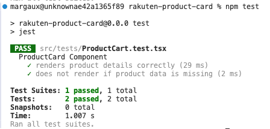

# Rakuten Product Card

This project is a **React-based product card component** built as part of a **technical test for an front-end developer application**.

The goal was to implement a product card UI according to a given design, using **Vite, React, TypeScript, and Material UI** while ensuring responsiveness and code quality.

## Table of Contents

- [Overview](#overview)
- [Requirements](#requirements)
- [Features](#features)
- [Technologies Used](#technologies-used)
- [Setup Instructions](#setup-instructions)
- [Development Process](#development-process)
- [Testing](#testing)
- [Deployment](#deployment)
- [Potential Improvements](#potential-improvements)
- [Contact](#contact)

---

## Overview

This component displays product details dynamically by fetching mock product data from a JSON file.

## Requirements

- Implement the visual design.
- any CSS solution or component library can be used. At Rakuten, we base many of our React components on MUI.

Bonus Point:

- ✅ Use TypeScript for the React part.
- ✅ Implement a responsive design.
- ✅ Ensure that components do not render if data is missing.
- ✅ Write tests for the React component.

## Features

- Displays product **image, title, brand, and pricing** based on mock data.
- Fully **responsive** with a **grid-based layout**.
- **Dynamic fetching** of product data, to simulate an API call.
- Implements **hover effects** on Product title.
- Uses **Jest and React Testing Library** for unit testing.
- Hosted on **GitHub Pages** for live preview.

---

## Technologies Used

- **React** (Vite)
- **TypeScript**
- **Material UI** (for layout and styling)
- **Jest & React Testing Library** (for unit tests)
- **GitHub Pages** (for deployment)

---

## Setup Instructions

### **1. Clone the repository**

```sh
git clone https://github.com/YOUR_GITHUB_USERNAME/rakuten-product-card.git
cd rakuten-product-card
```

### **2.Install dependencies**

```sh
npm install
```

### **2.Run the dev server**

```sh
npm run dev
```

### **2.Run jest tests**

```sh
npm test
```

## Development Process

### **1. Component Implementation**

- Built a `ProductCard.tsx` component using **React & TypeScript**.
- Applied **Material UI Grid** for layout.
- Integrated a **JSON-based API simulation** to fetch product details dynamically (to simulate an API call)

### **2. Styling & Responsiveness**

- Used **Material UI’s `sx` prop** for styling
- Ensured **text wrapping and spacing matched the design specifications**.

### **3. Testing**

- Wrote 2 unit tests using **Jest & React Testing Library**.
- Test 1: Renders correctly with mock data.
- Test 2: Does not render when no data is available.

Below is a screenshot of the Jest tests passing:


### **4. Deployment**

- Configured **GitHub Pages** for hosting the page

---

## Deployment

The project is deployed on GitHub Pages and can be accessed at:

**[Live Demo](https://margaux-works.github.io/rakuten-product-card/)**
